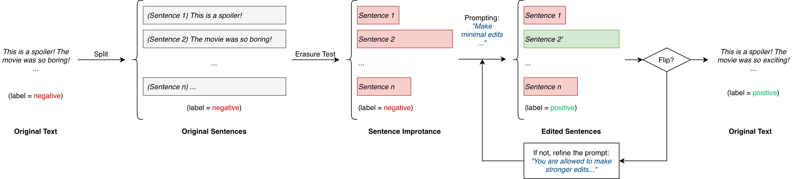

# Counterfactual Generation for Long Texts

This repository contains the implementation of our paper: **“Counterfactual Generation for Long Texts”**.



Our method introduces a **two-stage pipeline** for generating coherent and minimally edited counterfactual examples (CFEs) for long-form text:

1. **Important Sentence Identification**  
   We estimate sentence-level importance using an erasure-based causal test to identify the most responsible for the classifier’s decision.

2. **LLM-Guided Minimal Rewriting**  
   A large language model (LLM) is prompted to minimally rewrite only these causal sentences to flip the model’s prediction while preserving coherence and text quality.

We evaluate the method on the **IMDB** dataset and achieve **high flip rate** and **state-of-the-art text quality** (grammar, cohesiveness, fluency), outperforming existing baselines.

---

## Requirements
- Python 3.8+  
- PyTorch  
- Transformers  
- OpenAI API key

---

## Usage

Run counterfactual generation on a CSV file containing an `orig_text` column:

```bash
python LCFE.py --csv_path data.csv --llm_model gpt-4.1-mini
```
Output are saved as `résults_raw.csv` with:
- `orig_text` 
- `gen_text`

You may want to covert it to proper format that can be evaluated (visit [notebooks](notebooks/) for more information).
